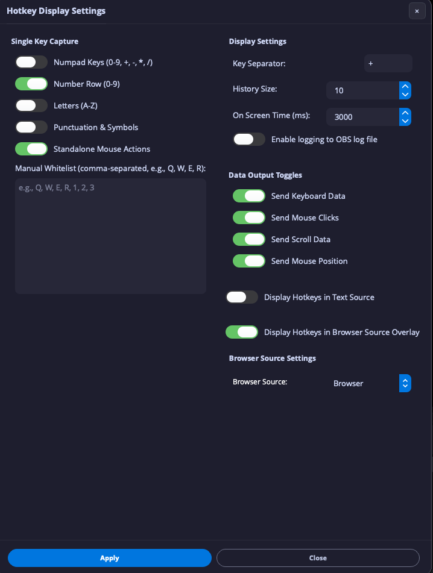

# StreamUP Hotkey Display for OBS Studio

**StreamUP Hotkey Display** is an OBS Studio plugin that visualizes your keyboard and mouse inputs in real-time. Designed for developers, educators, and high-performance gamers, it provides a sleek, high-performance overlay that shows exactly what you're pressing including real-time mouse coordinates and scroll intensity.

## 🚀 What's New: The WebSocket Revolution

The plugin has evolved from a simple text-source display to a robust WebSocket-driven architecture. By leveraging a dedicated **Browser Source** (CEF), you can now enjoy javascript and css animations driven by the plugin.
Menu with Mouse Position and Browser Source output

Browser Source visualizing plugin events. 

https://github.com/user-attachments/assets/aaa99bec-d0df-4b2a-870a-462606dbd466

## 🛠 Features

### 💎 Premium Browser Overlay
- **Modern Design**: Javascript and CSS-driven animations.
- **Zero-Config Auto-Auth**: The plugin automatically detects your OBS WebSocket credentials and injects them into the overlay URL. No manual setup required.
- **High Performance**: Uses a private "Exclusive Subscription" mode to filter out background OBS noise, ensuring zero lag even during intense sessions.

### 🖱 Elite Mouse Tracking
- **Real-time Position**: High-frequency tracking of your (X, Y) cursor coordinates (throttled to 50Hz for efficiency).
- **Scroll Speed & Direction**: Dynamically calculates and visualizes scroll velocity.
- **Selective Output**: Toggle exactly what data is sent to the overlay—capture everything or just specific actions.

### ⌨️ Comprehensive Key Capture
- **Complex Combinations**: Native support for all major modifiers (Ctrl, Alt, Shift, Cmd/Super).
- **Single Key Modes**: Optional capture for numpads, letters, symbols, and punctuation.
- **Custom Whitelisting**: Manually specify exactly which keys should be captured standalone.

### 🖥 Integrated OBS Dock
- **Live Preview**: Monitor your current combinations and history right inside the OBS UI.
- **One-Click Control**: Start/Stop monitoring and access settings directly from the dock.
- **Configurable History**: Track up to 50 recent combinations with adjustable auto-clear timers.

## 🔧 Technical Details

### Plugin API (WebSocket v5)
Registered under the `streamup-hotkey-display` vendor. 

Events emitted: `input_event` (Structured JSON containing key combos, mouse position, actions, and scroll metadata).

| Request | Description |
|---------|-------------|
| `get_status` | Returns capture status and last known combination. |
| `enable` / `disable` | Toggles the global input hooks. |
| `get_last_combination` | Retrieves the most recent combination. |

## 🏗 Build & Installation

### Requirements
- **Windows**: Windows 10/11
- **macOS**: 10.15+ (Requires Accessibility Permissions)
- **Linux**: X11 environment (Wayland supported via XWayland/XCB)

### Compiling
1. Clone this repository to `frontend/plugins/obs-streamup-hotkey-display`.
2. Add `add_subdirectory(obs-streamup-hotkey-display)` to your `frontend/plugins/CMakeLists.txt`.
3. Rebuild OBS Studio or build out-of-tree using provided CMake presets.

## 🤝 Support & Community

Built and maintained by **Andi**. If this plugin helps your workflow, consider supporting its continued development.

- [**Memberships**](https://andilippi.co.uk/pages/memberships) - Access all products and exclusive perks
- [**PayPal**](https://www.paypal.me/andilippi) - Support the developer
- [**Twitch**](https://www.twitch.tv/andilippi) - Tutorials and live dev sessions
- [**YouTube**](https://www.youtube.com/andilippi) - Streaming setup guides

---
*© 2026 StreamUP. Licensed under the GPL-2.0.*
